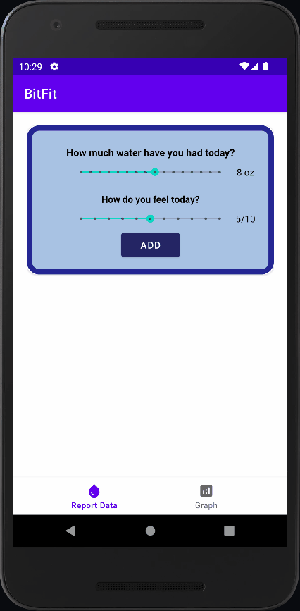
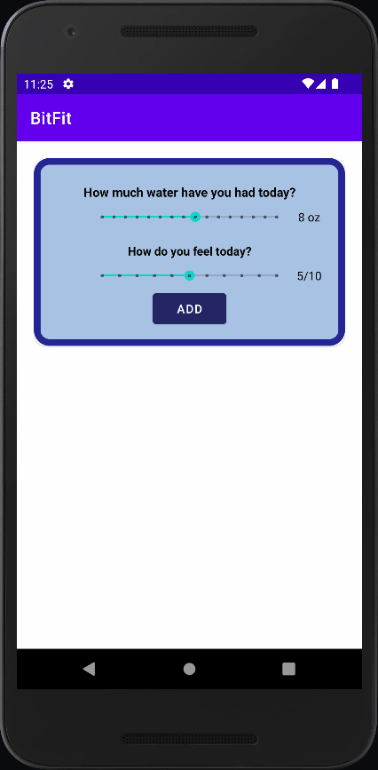

# Android Project 6 - *BitFit*

Submitted by: **Krrish Verma**

**BitFit** is a health metrics app that allows users to track their daily water consumption.

Time spent: **4** hours spent in total

## Required Features

The following **required** functionality is completed:

- [x] **Use at least 2 Fragments**
- [X] **Create a new dashboard fragment where users can see a summary of their entered data**
- [X] **Use one of the Navigation UI Views (BottomNavigation, Drawer Layout, Top Bar) to move between the fragments**

The following **optional** features are implemented:

- [X] **Add a more advanced UI (e.g: Graphing) for tracking trends in metrics**
- [ ] **Implement daily notifications to prompt users to fill in their data**

The following **additional** features are implemented:

- [ ] List anything else that you can get done to improve the app functionality!

## Video Walkthrough

Here's a walkthrough of implemented user stories:

<!-- Replace this with whatever GIF tool you used! -->
GIF created with ScreenToGif
<!-- Recommended tools:
[Kap](https://getkap.co/) for macOS
[ScreenToGif](https://www.screentogif.com/) for Windows
[peek](https://github.com/phw/peek) for Linux. -->

## Notes

I had some trouble with getting the button to add data which was fixed by using onViewCreated instead of onCreateView.

## License

    Copyright 2023 Krrish Verma

    Licensed under the Apache License, Version 2.0 (the "License");
    you may not use this file except in compliance with the License.
    You may obtain a copy of the License at

        http://www.apache.org/licenses/LICENSE-2.0

    Unless required by applicable law or agreed to in writing, software
    distributed under the License is distributed on an "AS IS" BASIS,
    WITHOUT WARRANTIES OR CONDITIONS OF ANY KIND, either express or implied.
    See the License for the specific language governing permissions and
    limitations under the License.

# Android Project 5 - *BitFit*

Submitted by: **Krrish Verma**

**BitFit** is a health metrics app that allows users to track their daily water intake.

Time spent: **7** hours spent in total

## Required Features

The following **required** functionality is completed:

- [x] **At least one health metric is tracked (based on user input)**
    - Chosen metric(s): Daily Water Intake
- [x] **There is a "create entry" UI that prompts users to make their daily entry**
- [x] **New entries are saved in a database and then updated in the RecyclerView**
- [x] **On application restart, previously entered entries are preserved (i.e., are *persistent*)**

The following **optional** features are implemented:

- [ ] **Create a UI for tracking averages and trends in metrics**
- [x] **Improve and customize the user interface through styling and coloring**
- [ ] **Implement orientation responsivity**
- [ ] **Add a daily photo feature**

The following **additional** features are implemented:

- [ ] List anything else that you can get done to improve the app functionality!

## Video Walkthrough

Here's a walkthrough of implemented user stories:

<!-- Replace this with whatever GIF tool you used! -->
GIF created with Screen To Gif
<!-- Recommended tools:
[Kap](https://getkap.co/) for macOS
[ScreenToGif](https://www.screentogif.com/) for Windows
[peek](https://github.com/phw/peek) for Linux. -->

## Notes

I had trouble while making the database but eventually fixed my issue by using DayEntity.kt instead of Day.kt to display data to the RecyclerView

## License

    Copyright [2023] [Krrish Verma]

    Licensed under the Apache License, Version 2.0 (the "License");
    you may not use this file except in compliance with the License.
    You may obtain a copy of the License at

        http://www.apache.org/licenses/LICENSE-2.0

    Unless required by applicable law or agreed to in writing, software
    distributed under the License is distributed on an "AS IS" BASIS,
    WITHOUT WARRANTIES OR CONDITIONS OF ANY KIND, either express or implied.
    See the License for the specific language governing permissions and
    limitations under the License.
